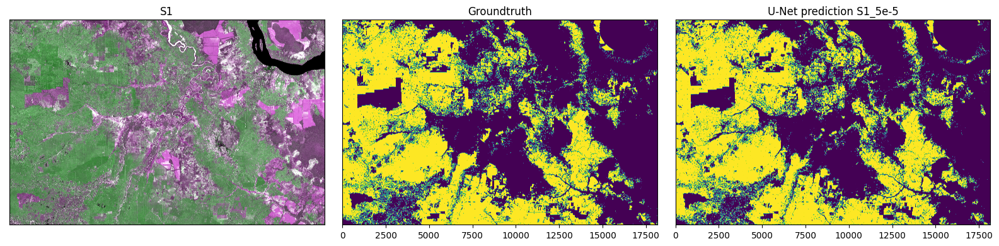

## Oil Palm Deep Learning (OPDL)

This is a repository for oil palm semantic segmentation from Sentinel-1 SAR and/or Sentinel-2 MS using fully convolutional neural network U-Net. 
The oil palm label was obtained from high-resolution oil palm map by Descals et al. 2021. 

### Background

### Methods
#### Dataset preparation
##### Sentinel-1 median composite 2019
##### Sentinel-2 median composite 2019
##### Oil palm closed-canopy (Descals et al. 2021)
##### Oil palm mixed-canopy (Gaveau et al. 2021)
##### Split to train/val/test
#### Deep learning model training
##### Single input
##### Stack input
##### Dual input (with spatial attention)
#### Inference

### Results
#### Accuracy metric
#### GIF
#### Interactive leaflet map year 2021

