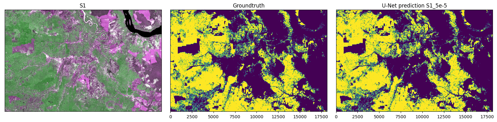
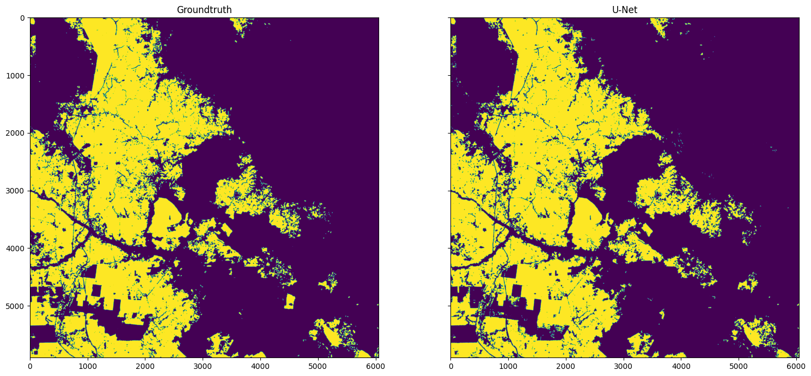
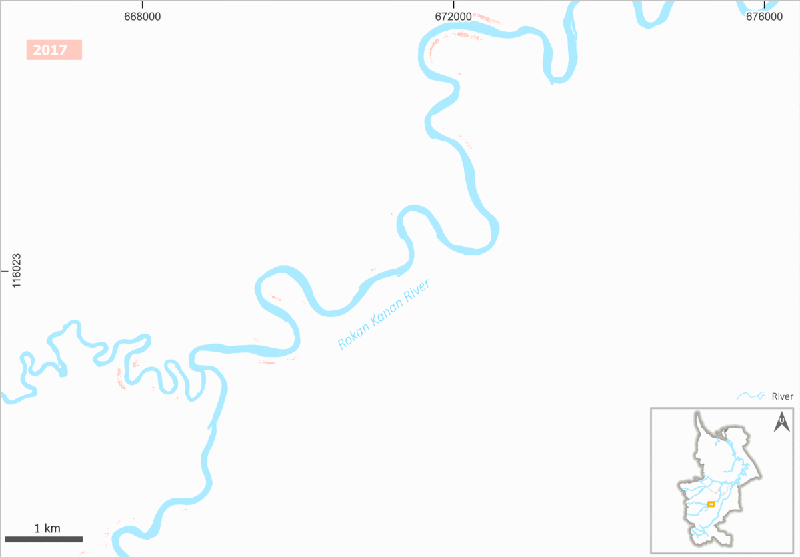

## Oil Palm Deep Learning (OPDL)

This is a repository for oil palm semantic segmentation from Sentinel-1 SAR and/or Sentinel-2 MS using fully convolutional neural network U-Net. The project was part of my MSc [thesis](http://essay.utwente.nl/97994/) supervised by [Iris van Duren](https://research.utwente.nl/en/persons/ic-van-duren) and [Raian V. Maretto](https://research.utwente.nl/en/persons/raian-vargas-maretto). The oil palm label was obtained from high-resolution oil palm map by [Descals et al. 2021](https://zenodo.org/record/4473715). 

### Background

### Methods
#### Dataset preparation
##### Sentinel-1 median composite 2019
##### Sentinel-2 median composite 2019
##### Oil palm closed-canopy (Descals et al. 2021)
##### Oil palm mixed-canopy (Gaveau et al. 2021)
##### Split to train/val/test
#### Deep learning model training
##### Single input

##### Stack input
##### Dual input (with spatial attention)
#### Inference

### Results
#### Model performances
#### Map accuracy
#### Changes on riparian zone

#### Interactive map for year 2021
An interactive view of the oil palm map along rivers produced from this study can be accessed at: 
-[Leaflet map](https://geografif/github.io/opdl) 
-[https://bit.ly/oilpalmrivers](https://bit.ly/oilpalmrivers) (depcrecated)

